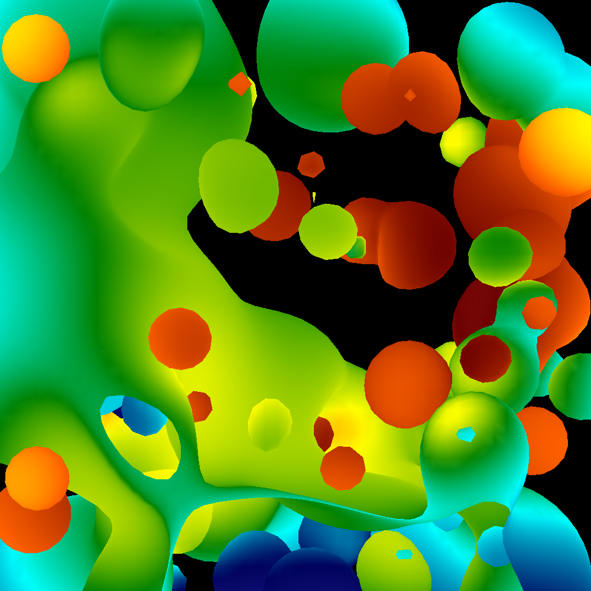
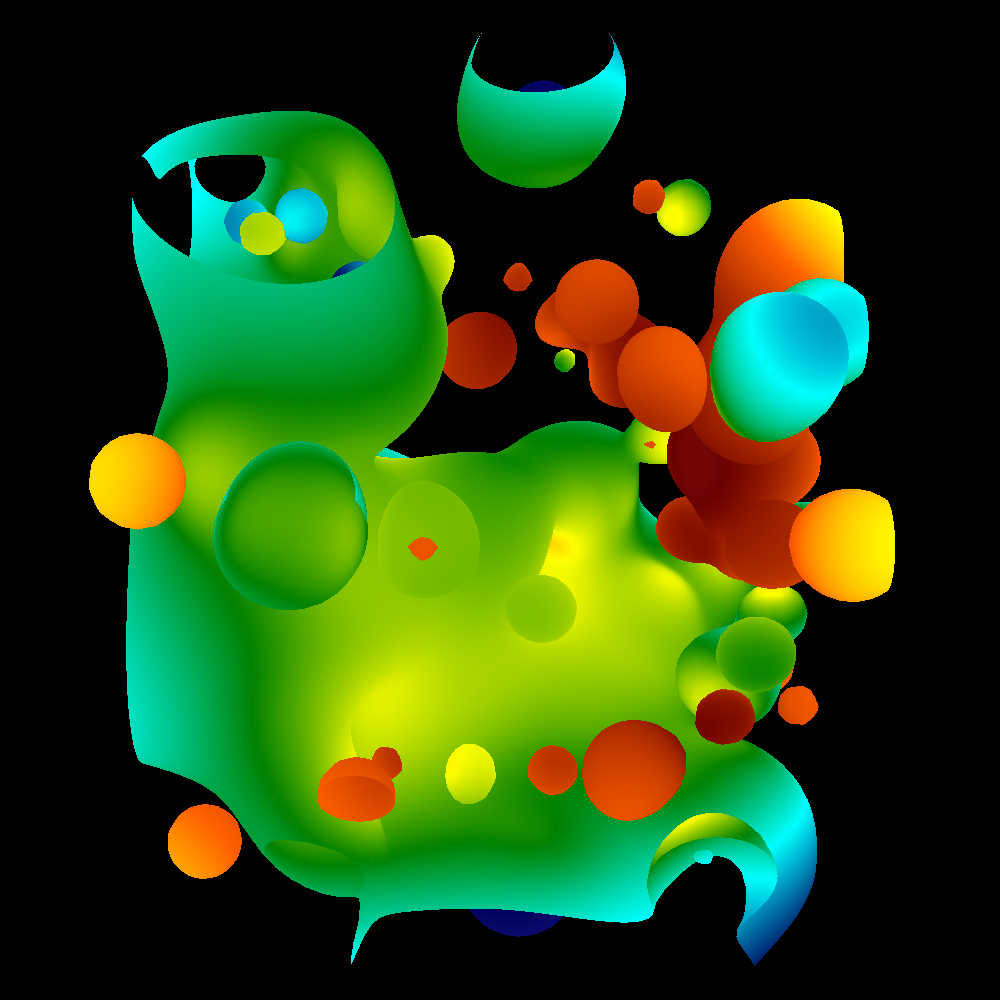
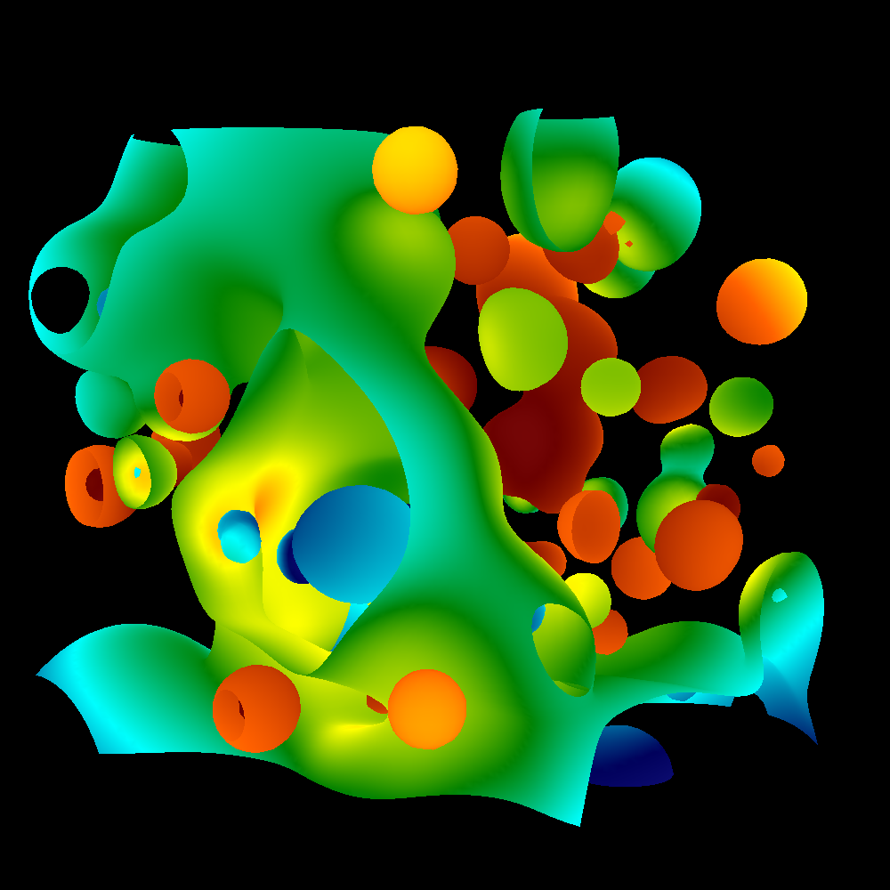

# CPU Based Graphics Renderer

This is a readme for a cpu based graphics renderer that I created, it includes techniques such as rasterization, phong shading, and camera control.

[Installation](#Installation)

[Rasterization](#Rasterization)

[Camera transformation](#Camera-transformation)

[Phong Shading](#Phong-Shading)

Final movie can be viewed here [Movie](https://www.youtube.com/watch?v=1PQ-9w8j_hk)

## Rasterization 
Rasterization is a technique to display three dimensional objects onto a two dimensional screen, in order to do that you will have to gather information about the triangles you are working with (information such as the colors and z-depth) in order to create a convincing 3D images onto a 2D space, Each pixel of the screen will be filled in with a color and the triangles are responsible of telling the computer what position the pixel to be colored is at and what color and whether it shows up depending on the z buffer. An example of an image that would show up with basic Rasterization is this 

## Camera Transformation
When rendering graphics you the code should be able to change triangle directions depending on where the viewer is looking, how do we do that? What has to be done is to think of the image as a matrix and start doing some linear algebra calculations in order to shift that image appropriately and in a way that makes sense. Below is the same image that is seen from two different viewpoints

## Phong Shading
Phong shading is a way to incorporate lighting into the image that you are creating, phong shading will interpolate the surface normals across polygons and will compute a pixel color based on the interpolation of the normals and the reflection model. Below you can see a comparison between a model that has phong shading and one without it.

## Final Thoughts
This project was alot of work and it taught me alot of things about programming and ways to code in a more efficient way and the importance of writing easy to read code so if you have to go back to it at a later date you can be able to adjust it easily. Most of all this project sparked my love of graphics! Hopefully one day I will be given the opportunity to take what I learned and start applying it to new and creative stuff.

## Authors
This code was created by Patrick Thomasma
Special thanks to Hank Childs for assistance on this project
